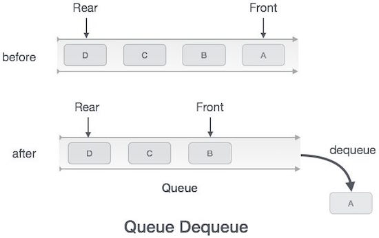
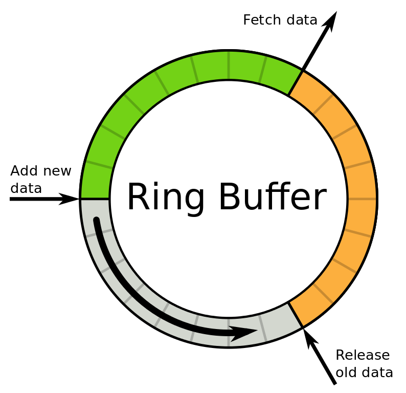

# Data Structures: _Queue_
.jpg)
## Introduction

A _queue_ is a linear data structure that stores elements in a sequential order, similar to a stack. However, unlike a stack, a _queue_ follows the First-In, First-Out (FIFO) principle, where the element that is added first is the first one to be removed. A _queue_ can be implemented using an array or a linked list, [to learn more click here.](https://logicmojo.com/data-structures-queue)

## Explanation

A _queue_ has two main operations:

1. **Enqueue**: This operation adds an element to the end of the _queue_. The newly added element becomes the last element in the queue.
2. **Dequeue**: This operation removes the element from the front of the _queue_, which is the element that has been in the _queue_ the longest.

Additionally, a _queue_ may have the following operations:

- **Peek/ Front**: This operation returns the element at the front of the _queue_ without removing it.
- **IsEmpty**: This operation checks if the _queue_ is empty.

The following diagram illustrates the concept of a _queue_:

Front Rear
+----+ +----+ +----+ +----+ +----+
-> | A | ->| B | ->| C | ->| D | ->| E |
+----+ +----+ +----+ +----+ +----+

In the diagram, elements A, B, C, D, and E are stored in the _queue_. Element A is at the front of the _queue_, and element E is at the rear of the _queue_. When a new element F is enqueued, it becomes the new rear of the _queue_, and the _queue_ becomes as follows:

Front Rear
+----+ +----+ +----+ +----+ +----+ +----+
-> | A | ->| B | ->| C | ->| D | ->| E | ->| F |
+----+ +----+ +----+ +----+ +----+ +----+

## Applications

_Queues_ have various applications in computer science and real-world scenarios, including:

1. **Print spooler**: _Queues_ can be used to store print jobs in a printer's spooler, ensuring that print jobs are processed in the order they are received.
2. **Breadth-First Search**: _Queues_ are used in graph algorithms such as Breadth-First Search (BFS) to explore vertices in a graph level by level.
3. **Process scheduling**: _Queues_ can be used to manage the order in which processes are executed in an operating system.
4. **Buffering**: _Queues_ are used to store incoming data that needs to be processed in a buffered manner, such as data packets in a network router.

## Advantages of _Queues_

_Queues_ offer several advantages, including:

1. **FIFO principle**: _Queues_ follow the FIFO principle, making them suitable for scenarios where the order of elements is critical, such as in printing or processing tasks.
2. **Simple implementation**: _Queues_ are easy to implement using arrays or linked lists, making them accessible to beginners in programming.
3. **Efficient time complexity**: _Queues_ provide efficient time complexity for enqueue and dequeue operations, typically O(1) for both operations when implemented using linked lists.
4. **Scalability**: _Queues_ can be used to store a large number of elements, making them suitable for applications that require handling a large amount of data.

# Problem to solve

- Create a list of customers.
- Loop through the list.
- Using the first in first out method.
- You will need to grab first item in the list and remove it.
- Use the append function to add customers to the queue.

You can check your code with the solution here: [Solution](queuesolution.md)

[Back to Welcome page](Welcome.md)

