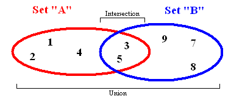
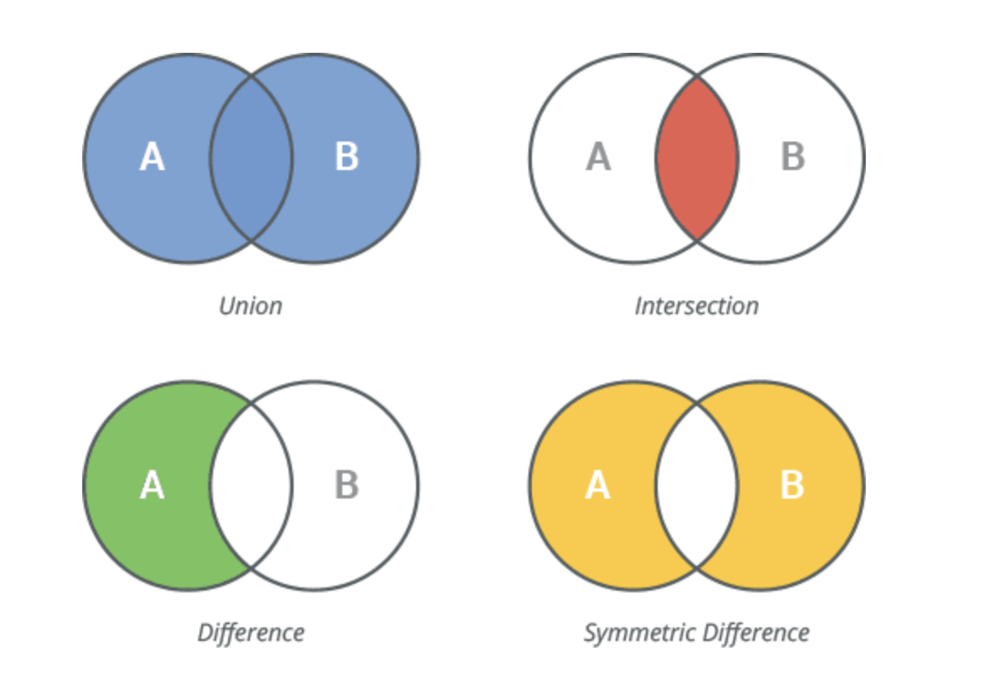
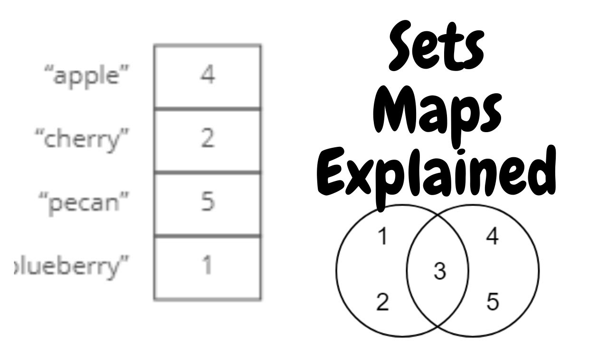

# **Python Data Structure: _Sets_**

-  Explanation
-  Creation of sets
-  Adding elements to a set
-  Removing elements from a set
-  Other important functions of set 
-  Frozen sets
-  Examples
-  Problems and Solution

## **1.	Explanation**

- **Sets** are a built-in data structure in Python that represent an unordered collection
 of unique elements enclosed in _curly braces {}_ or _()_. They can be used to perform 
mathematical set operations such as **union, intersection, difference and symmetric
 difference**.
 
 - Also, **sets** are _mutable_, which means you can add and remove elements from them.
 - Nevertheless, **sets** cannot have a _duplicate value_ but sets can store a mixture of heterogeneous 
elements like **string, integer, Boolean, datatypes**, etc. 
[If you want to learn more](https://www.w3schools.com/python/python_sets.asp).

## **2.	Creation of Sets**

 - **Sets** can be created by enclosing a comma-separated sequence of elements in curly 
braces {} or by using the set() constructor function but if you want to create an 
_empty_ dictionary you’ll need to use set(), not the curly braces {}. 
 - Is valid to mention that _**two sets**_
 can be _combine_ using union() method or | operator. 

## **3.	Adding elements to a Set**
- Elements can be added to a **set** using the _add()_ method or by using the _update()_
 method to add multiple elements at once.
 - Inserting the **set** is completed through the _set.add()_ method, so it’s become 
a expected value created to hold in the hash table. 

## **4.	Removing elements from a set**

 - Elements can be removed from a **set** using the _remove()_ or _discard()_ method. 
 - The difference between these two methods is that _remove()_ will raise an error 
if the element is not found, while _discard()_ will not. 
 - Although using the _remove()_ function or _discard()_ function it will work 
regardless of whether it exists in the **set** or not.

## **5.	Other important functions of Set**
 - Some important functions of **sets** include _union(), intersection(), difference(),
 symmetric_difference(), issubset(), issuperset(), and copy()_. 
 - These functions allow you to perform various operations on **sets**, such as 
**combining two sets, finding common elements, finding differences between sets, and checking whether a 
set is a subset or superset of another set**. 
 - To clearing the **set** file you use the _clear()_function and it will empty the whole **set** that was 
established. 
 - See the whole [list](https://www.w3schools.com/python/python_ref_set.asp) of **Python Set Methods**.

## **6.	Frozen Sets**
 - Frozen **sets** in _Python_ are immutable **sets** that can be created using the
 _frozenset()_ constructor.
 - Also, frozen **sets** are similar to _**sets**_, but they are immutable, which 
means you cannot add or remove elements from them. 
 - To create a frozen **set**, you can use the _frozenset()_ function that support 
methods/operators that produce an outcome without impact the frozen sets to which 
they are applied to.

## **7. Examples of Sets**
 - set1 = {1, 2, 3, 4, 5}
 - set2 = set([3, 4, 5, 6, 7])
 - set1.add(6)
 - set2.update([7, 8])
 - set1.remove(3)
 - set2.discard(9)
 - set3 = set1.union(set2)
 - set4 = set1.intersection(set2)
 - set5 = set1.difference(set2)
 - set6 = set1.symmetric_difference(set2)
 - set7 = set1.issubset(set2)
 - set8 = set2.issuperset(set1)

## **8. Problems to solve on your own:**

 - Given two **sets** of strings, write a Python program to find their intersection and union
  1. A = {'ab', 'ba', 'cd', 'dz'}
  2. B = {'cd', 'ab', 'dd', 'za'}

**Output:**
A U B: {'za', 'ab', 'dd', 'dz', 'ba', 'cd'}

You can check or compare your code with the solution here:[Solution](setsolution.md) 

[Back to Welcome Page](Welcome.md)
