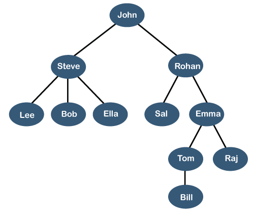
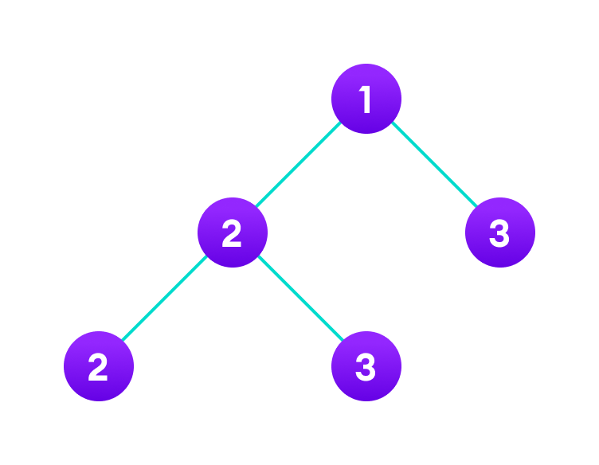

# **Python Fundamental Data Structures Tutorial: _Tree_**

> 	Explanation
>   Basic Operation
>   Traversals
>   Standard Problems on Binary trees
>   Examples 
>   Problems and Solution
>   Problems to Solve on your own

## **1.	Explanation**

A tree is a fundamental data structure in computer science that consists of nodes connected by edges. The topmost node is called the root, and each node can have zero or more child nodes. Tree are used in various applications, such as organizing hierarchical data, representing family trees, and searching through data efficiently. In Python, you can implement a tree using classes and recursion. Also, a tree is a widely used data structure in computer science that represents a hierarchical structure. Nodes without any children are called leaves. 
As [Aditya Raj](https://www.pythonforbeginners.com/data-structures/tree-data-structure-in-python/) writes about **_Tree Data Structure in Python_**

## **2.	Basic Operation**

Basic operations on a tree include creating a new tree, adding a node to a tree, deleting a node from a tree, and searching for a node in a tree. A tree is also one of the data structures that represent hierarchical data. Suppose we want to show the employees and their positions in the hierarchical form then it can be represented as shown below:

## **3.	Traversals**
There are different ways to traverse a tree, including in-order traversal, pre-order traversal, and post-order traversal. In-order traversal visits the left subtree, then the root, then the right subtree. Pre-order traversal visits the root, then the left subtree, then the right subtree. Post-order traversal visits the left subtree, then the right subtree, then the root.
## **4.	Standard Problems on Binary trees**

Standard problems on binary trees include finding the height of a tree, determining whether a tree is balanced, and finding the lowest common ancestor of two nodes.

## **5.	Examples**

Examples of trees include:
* file systems
* family trees
* organizational charts
* etc.
## **6.	Problems and Solution**

Problems and solutions related to trees can range from simple recursive algorithms to complex data manipulation. It is _important_ to understand the basics of trees and their operations in order to effectively solve problems related to them.

## **Problems to solve on your own:**
_Write a Python program to create a Balanced Binary Search Tree (BST) using an array of elements where array elements are sorted in ascending order._

class TreeNode(object):
(write here…)

def sorted_array_to_bst(nums):
(write here…)

def preOrder(node): 
(write here…)

result = sorted_array_to_bst([1, 2, 3, 4, 5, 6, 7])

preOrder(result)

**Output:**
4
2
1
3
6
5
7

You can check or compare your code with the solution here: [Solution](solutiontree.md)

[Back to welcome page](Welcome.md)

